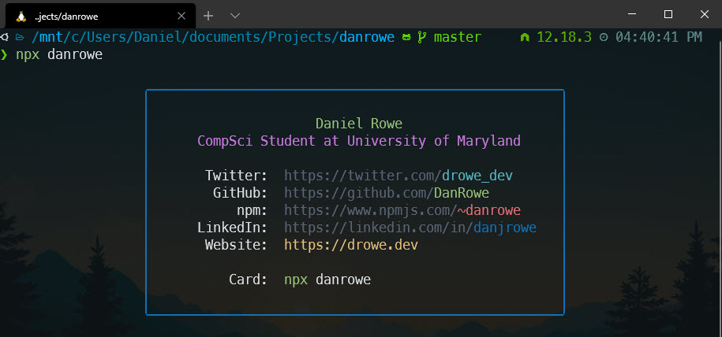

# Cartão de visita Npx



Meu cartão de visita Npx para se conectar comigo através do terminal.

```sh
npx diegohorvatti
```

------

## Completo Crie o seu próprio

Veja isso [article](https://studioelsa.se/blog/open-source-oss-npx-business-card/) to understand how creating the cli tool in node works.

Então confira isso [dev.to article](https://dev.to/wuz/setting-up-a-npx-username-card-1pip) que usa [bitandbang's repo](https://github.com/bnb/bitandbang/blob/master/build.js) para algum estilo avançado usando [chalk](https://www.npmjs.com/package/chalk).
